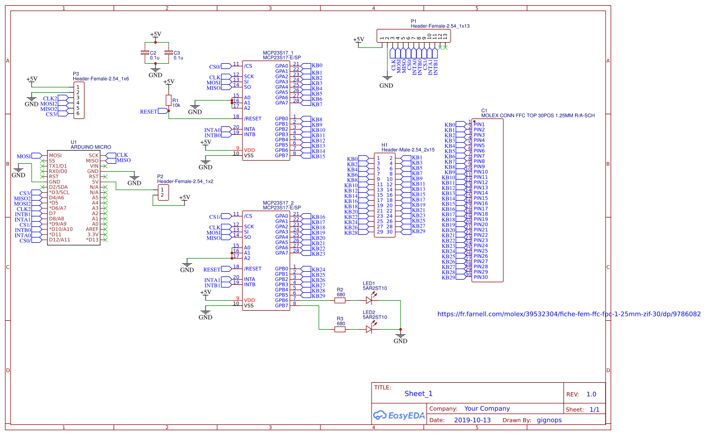
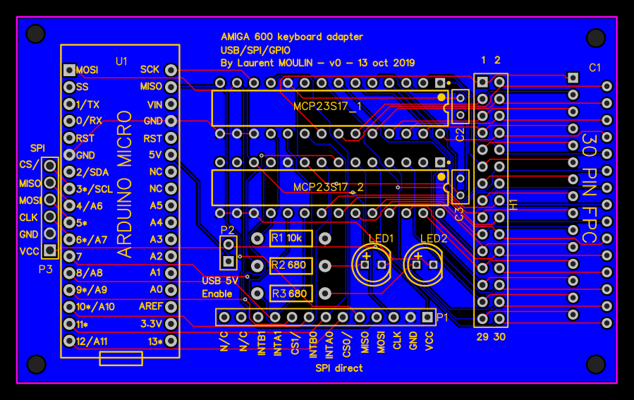

# Amiga 600 Keyboard adapter

This repository is about a board and the related software to make an 
Amiga 600 keyboard adapter. It manages SPI, Direct I/O and USB !

[**UPDATE**] : The keyboard is now fonctional but some keys are not well binded.
# Why

Well, Amiga computers were an important part of computer history. When I was very young, a friend introduced me an Amiga. And I always found the design very impressive.

Now we can find Amiga 600 keyboard for less than 20€, the same for the case. I recommand you to take yellowed parts (more cheaper !) and to clean them. You can unyellow them using hydrogen peroxyd (the 8 bit guy youtube channel introduces this subject).

It can be useful for retro computer design ([retroputer](https://github.com/laulin/retroputer)) or to use with Raspberry pi. But Amiga 600 use a matrix keyboard, Raspberry pi expects an USB one and arduino do no has enough GPIO to handle it. Not very handy ...

Let's talk about problem you faced when you want to find a way to adapt Amiga 600 keyboard :
- only [one web site](https://frontier.town/2014/04/reverse-engineering-amiga-600-keyboard/) talks about that in details, but many information are missing.
- Rare boards exist but they are too expensive !

So it is costy and you do not understand nor control your keyboard.

May be can we find a solution ? (spoiler alert : yes :) )

# How

The first problem is the plug to use. I recommand to use the molex one :

```
39532304 -  Connecteur carte FFC / FPC, ZIF, 1.25 mm, 30 Contact(s), Embase, Easy-On 5597 Series, Traversant 

https://fr.farnell.com/molex/39532304/fiche-fem-ffc-fpc-1-25mm-zif-30/dp/9786082
```

About number of pins. If you look at the [A600 schematic](documentation/A600_R1.5.pdf), you see you need 30 pins. 28 pins if optimize. Since many chip are power of 2 base, you should use 32 pins to decode the keyboard. I commonly use MCP23S17 chip - a 16 bits port expander - so I use them.

The goal is to make the keyboard available for all purposes, so I/O is important :

- parallel one : directly connected on FCC plug I use a 30 pins headers (2.54mm)
- raw spi : I add a header to control directly both 23S17
- USB : to enable this feature, I set a arduino micro footprint on the board; This arduino has support of USB as keyboard
- spi : using the previous arduino, you can read the keyboard more easily than raw spi (already decoded, buffer, etc)

As I explained, I didn't find documentation about keyboard pinout. And the one I found seems to be incorrect. So I reverse it.

The keyboard is a matrix, with 
* x : PIN 1 to 16
* y : PIN 17 to 30

There is a led caps lock but to make the job easier, I do not use it.


# About PCB

The public PCB and shematic are available [here](https://easyeda.com/gignops/amiga600_keyboard_adapter).

Schematic:



PCB:



[BOM](documentation/bom.csv)

# Current status

Currently, you can use the keyboard on USB. Some keys need to be fixed for a perfect stuff.

# Thanks

* FTL-sama (Chris) to introduce me to the computers worlds
* rdowner to write the article on frontier.town
